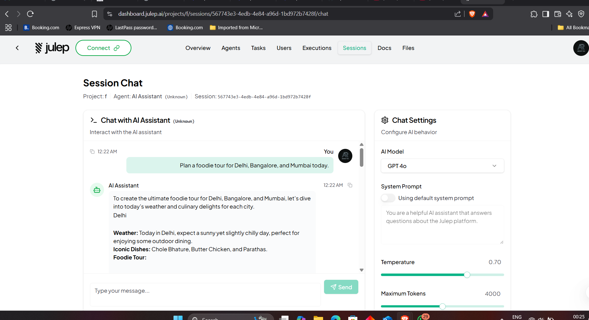
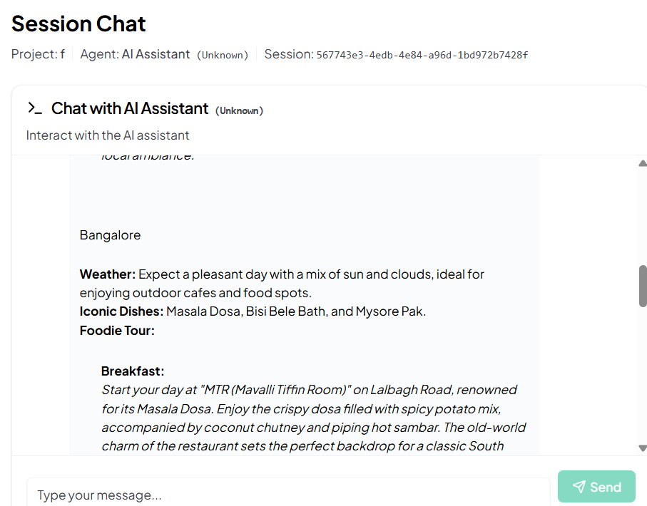
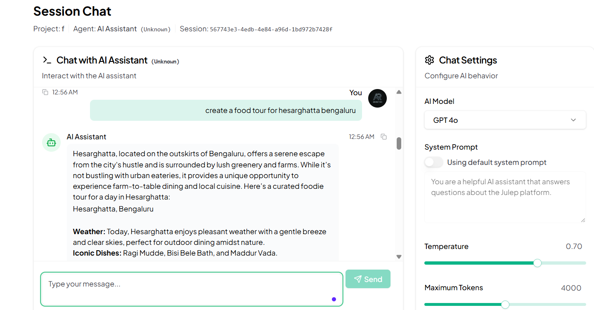
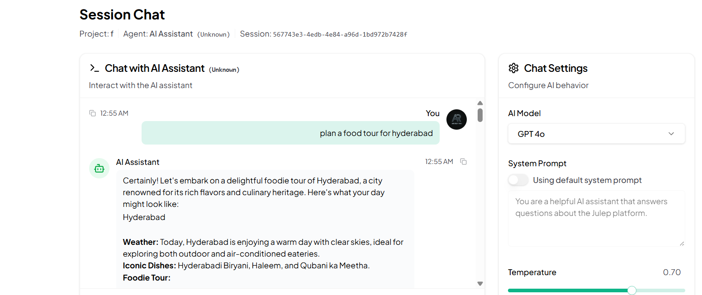

# 🍽️ Foodie Tour Planner with Julep AI

Hi there! 👋

This project is part of my assignment for the **Founder's Office Role @Julep AI**.

As a fresher, I was really excited to try something practical and fun. Using Julep’s no-code platform, I created a small app that helps plan a foodie tour for different cities — based on the day’s weather and famous local dishes. The best part? I didn’t need to write any backend code or connect APIs. It all worked smoothly using Julep’s interface!

---

## 🧠 What I Tried to Build

The goal was to create an agent that:
- Takes names of a few cities
- Checks the weather in each city
- Suggests indoor or outdoor meals depending on weather
- Picks 3 famous local dishes
- Recommends well-known restaurants
- Gives a simple foodie plan for the day (Breakfast, Lunch, Dinner)

---

## ✨ What Works

- It adjusts meal plans based on whether it’s sunny or humid
- It gives different dishes and places for each city
- It writes out a short, full-day food tour — in a friendly, story-like way
- All of this happens just by chatting with the AI agent

---

## 🏙️ Cities I Used for Demo

I tested this with:
- **Delhi** 🌞
- **Bangalore** 🌤️
- **Mumbai** 🌡️

---

## 📸 Screenshots

Here’s how it looks when the agent responds inside Julep:

### 📍 Food Tour for Delhi, Bangalore, and Mumbai  

### 📍 Bangalore Tour Details  

### 📍 Bangalore Hesarghatta Tour Details  

### 📍 Hyderabad Tour Details  

)

---

## 🔧 What I Used

- **Julep AI Platform**
- **GPT-4o Model**
- No backend code or external APIs needed

---

## 🙌 Final Thoughts

This was my first time trying Julep, and honestly, it was super fun to see results this quickly.

As a beginner, I could build a working idea without writing much code. It helped me understand how powerful AI can be when paired with a no-code setup.

Thanks for checking it out! 😊

**— Aniket Rai**
